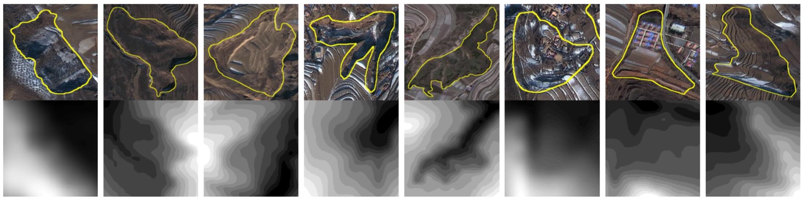

# NXPLH-Dataset
Ning Xia Potential Landslide Hazard Dataset

We created a publicly available remote sensing potential landslide dataset called Ningxia potential Landslide Dataset (NXPLHD) for the remote sensing potential  landslide identification task.  All the images in this dataset, i.e.  313 sets of potential landslide images and 1039 sets of non-potential landslide images. We choose special scenes such as cultivated land, mountain ridges, cloud cover, snow cover, roads, lakes, vegetation, factories, etc. as non-potential landslide samples.

The optical remote sensing image is the high-fraction 2 (GF2) satellite image in early 2020, which has a spatial resolution of 1m, and the DEM has a spatial resolution of 30m. In order to achieve the same resolution as the GF2 image, the DEM data is interpolated by three convolutions to achieve a resolution of 1m.

For each potential  landslide site, we provide the remote sensing image of the site (\*.tif), the potential  landslide shapefiles (mask, \*.tif) and the corresponding DEM (\*.tif), and for each potential  landslide site, we provide the corresponding location coordinates and disaster-bearing body information (attribute.xlsx), the image size is affected by the size of the area of the site, and the size of the image of the site ranges from 107*69 to 1228\*971, for the non-potential landslide site image, we also provide the remote sensing image and DEM, we cropped the non-landslide site data in random proportion, so that its aspect ratio is similar to the distribution of the landslide site data.

All datasets collated in this project can be used for academic research only, please do not use them for commercial purposes. 如If you have any problem on the use of NXPLHD dataset,  please contact: rfwang@xidian.edu.cn

